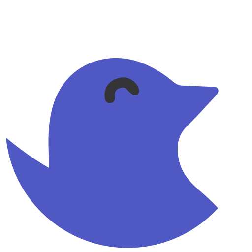
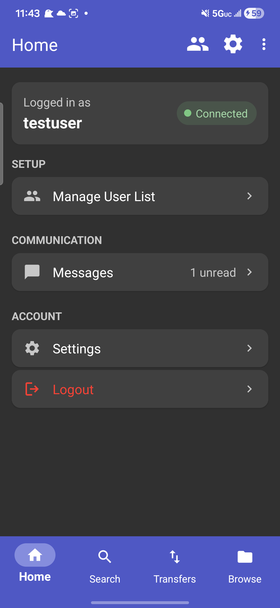
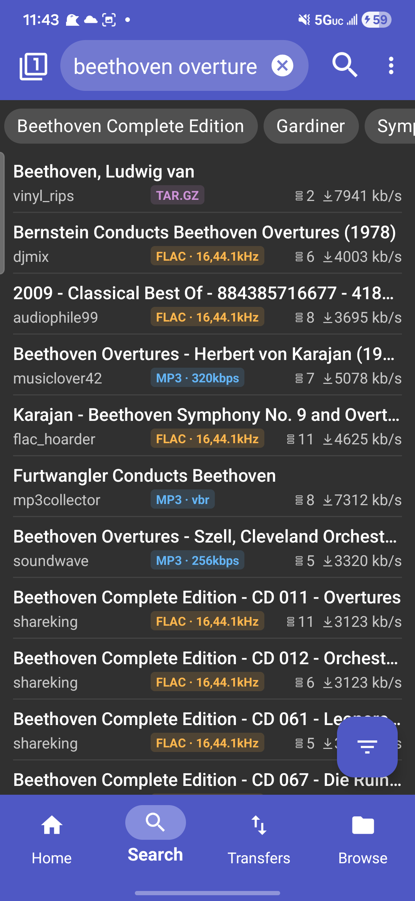
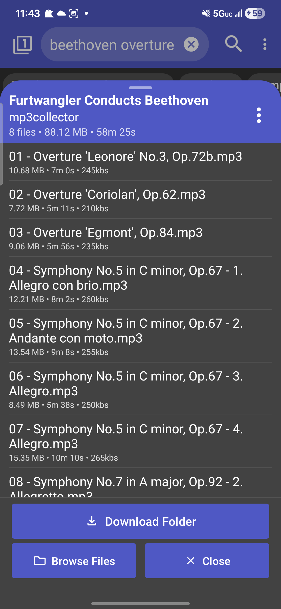
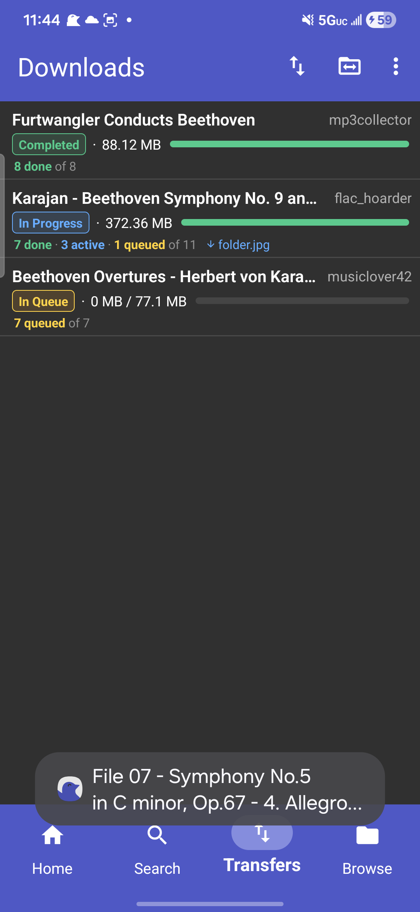
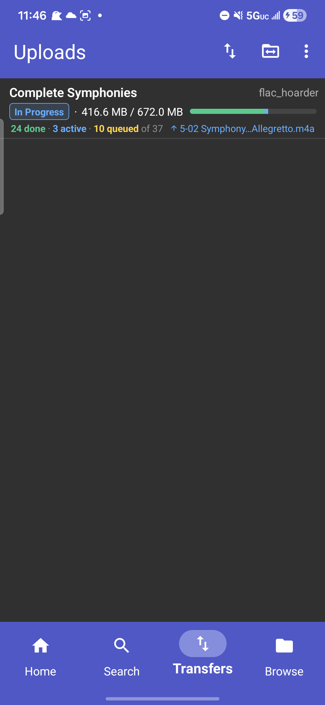
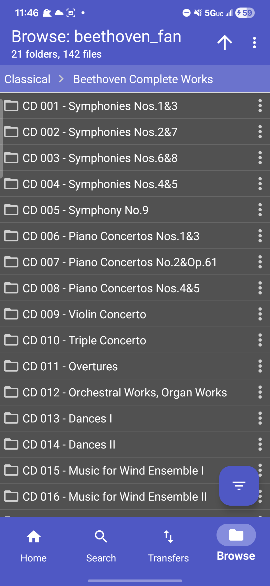

<h2><b>Seeker</b></h2>
<h4>A Soulseek client for Android.</h4>

Seeker is a [Soulseek](https://en.wikipedia.org/wiki/Soulseek) client for Android written in C# supporting downloading, searching (including wishlist and filters), sharing, messages, chatrooms, port forwarding, user info, privileges, and more.

This work uses the [Soulseek.NET](https://github.com/jpdillingham/Soulseek.NET) library for communicating with Soulseek server and network peers.  It also references the unofficial [Soulseek Protocol Documentation](https://nicotine-plus.github.io/nicotine-plus/doc/SLSKPROTOCOL.html) implemented by the developers of the [Nicotine+](https://github.com/nicotine-plus/nicotine-plus) client.

- The Soulseek server, which makes this app possible, relies on donations. Donate: [here](https://www.slsknet.org/donate.php)

- Please help translate: [here](https://crowdin.com/project/seeker)

- Official release is through Google Play store: [here](https://play.google.com/store/apps/details?id=com.companyname.andriodapp1&hl=en_US&gl=US)

This app will always be completely free and open source software, no ads, no 'premium' versions or paid features, etc.

---

## Screenshots

---

